#  Adventure-Works2019
##  A study on Adventure Works 2019 relational database from Microsoft.
In this project, SQL is used for Data Cleaning and Data Manipulation, Python(pandas,matplotlib) for data Visualization,SQL SSMS for Data transformation.
With the use of specific data found in Adventure works we were tasked to answer the following questions:

**1.What is the relationship between Country and Revenue?**

Get the table Sales.SalesTerritory which relates country and revenue.

Get the columns needed CountryRegionCode,SalesLastYear,SalesYTD

Calculate total sales by country using functions SUM(),GROUP BY and alias total sales using AS in SQL.

Save the query using VIEW in SQL.

To visualise the data,connect SQL server in Visual Studio Code.Create dataframe from the saved query.

Import the libraries matplotlib,pandas,numpy.Create a dataframe for SQL query.Add new column CountryName to the dataframe.

Plot by horizontal bar graph which compares the sales data for last year and current year.
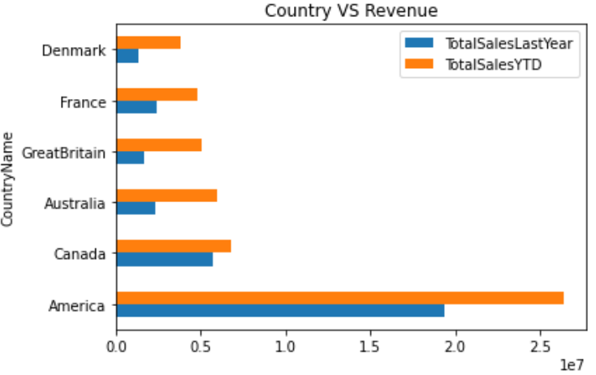

For further understanding plot pie chart forSales last Year and SalesYTD using corresponding codes in visual studio code.

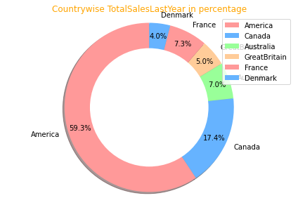
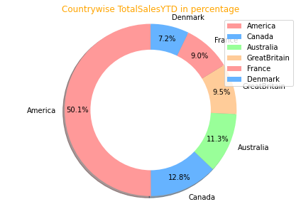

**2.What is the regional sales in the best performing country?**

Firstly, we need to find the data of sales per country in the Sales.SalesTerritory table, Sales YTD, Sales Last Year columns and define the highest performing country by SQL using SUM(), MAX() and GROUP BY function. Create a view for that. 

Secondly, calculate the sales by regions of the highest performing country in SQL using SUM(), GROUP BY() and WHERE. At this step, we have the table we needed. Create a view for this. Called Regional_Sales.

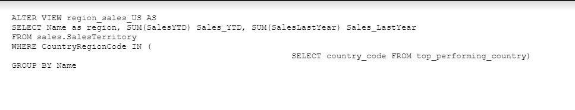

Thirdly, import the Regional_Sales table to Jupiper Note using pyodbc and create a DataFrame. Importing other libraries including pandas, matplotlib, pyplot, numpy, and json for further use.

To visualise the data, we’ll go with bar chart (Matplotlib) to show the total sales of each region and compare the value of sales YTD and last year. This could be done using Matplotlib. The chart helps show the differences between the two years but can’t see the YOY and percentage.

We’ll then use double pie charts to plot the dataset into two separate pies/donuts that contain the percentage of each year and the pies’ size also illustrate the scale of sales each year. To make the visual look good and interactive, we could us pyplot that offer the flexibility.

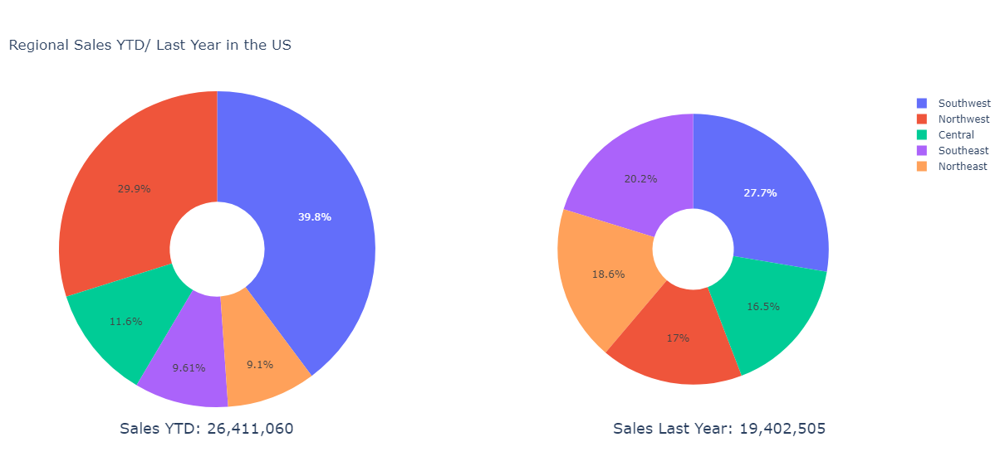

**3.What is the relationship between annual leave taken and bonus?**

First step is to find  the tables in Adventure works database  which has annual leave(VacationHours) and Bonus columns.

The 2 identified tables are HumanResources.Employee and Sales.SalesPerson. 

INNER JOIN them on the common column BusinessEntityID.
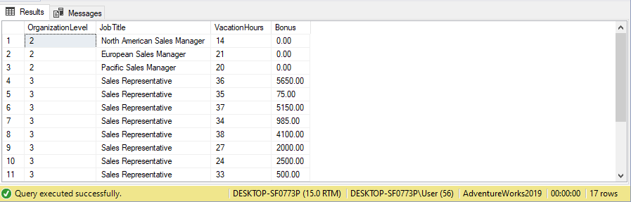

Save the query Creating View and import the data to python using Jupiter Notebook.
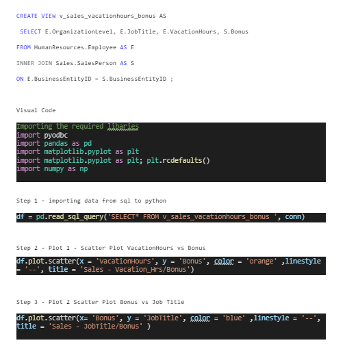

To visualise the data and find the relationship between them, we will use scatter plot ( Matplotlib) 

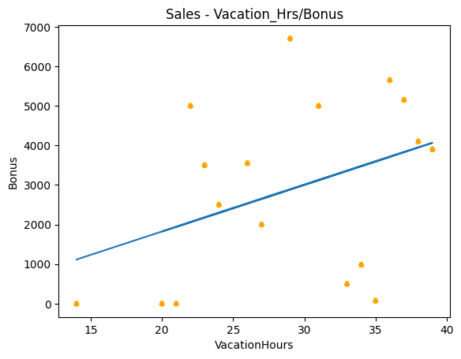

**4.What is the relationship between sick leave and Job Title?**
Get the table HumanResources.Employee

Firstly, get two columns JobTitle and SickLeaveHours

Use aggregate function (AVG) to calculate average sick leave hours for each job title

Group them by JobTitle 

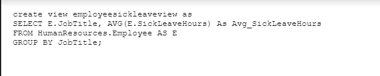

Secondly, get three columns JobTitle, SickLeaveHours and OrganizationLevel, the same as in first query use AVG function to calculate average sick leave hours
Save the queries.

Create view for both of them

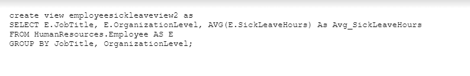

Create new file in JupyterNotebook and import view from SQL Server

Import libraries - matplotlib, pandas, numpy, seaborn

With first query, I visualise relationship between job titles and sick leave hours with  bar plot (Matplotlib)
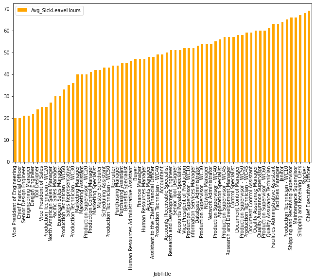

With the second query, I visualise the relationship between job titles, sick leave hours and organisation level. 

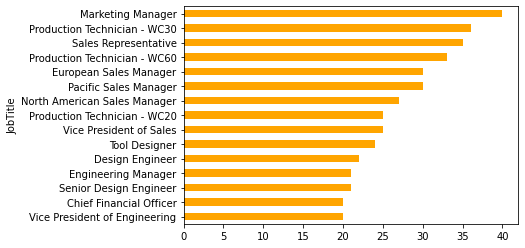

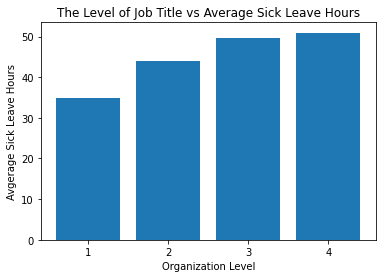

**5.What is the relationship between store trading duration and revenue?**

Write SQL code to get data frame we need. GROUP BY year opened, use AVG() for the Annual Revenue for each year group, create a new column trading_duration by subtracting year opened from 2014 ( as 2014 is current year for the database). 
Create a view duration_vs_rev
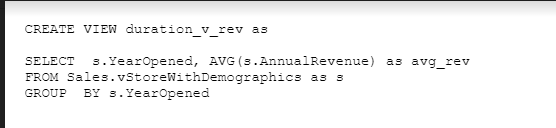
In Visual Code Studio import pyodbc, matplotlib.pyplot, pandas, numpy and seaborn.
Import the view to Visual Code Studio
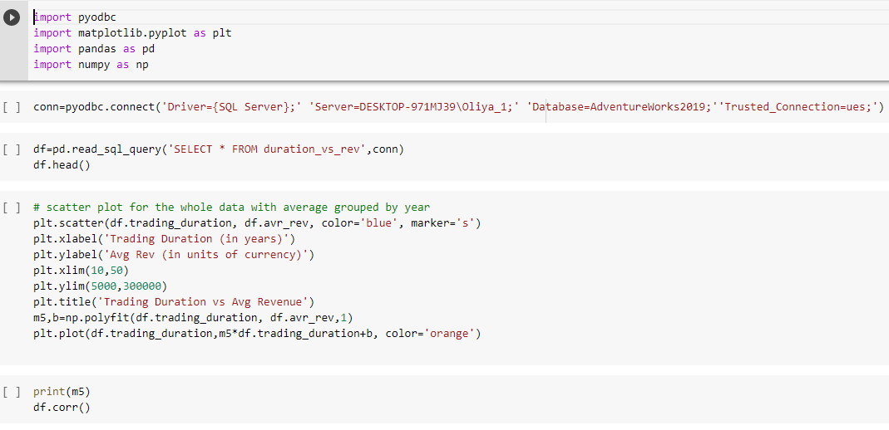
Create a graph using matplotlib - the choice of  a scatter plot is defined by the task to find the relationship between two numerical sets of data.
Run corr() function to verify conclusion made on the base of the scatter plot.

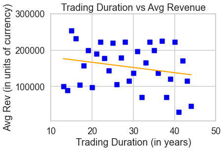

